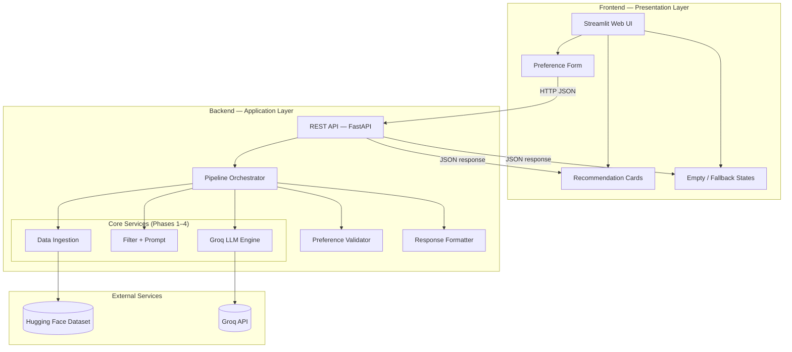
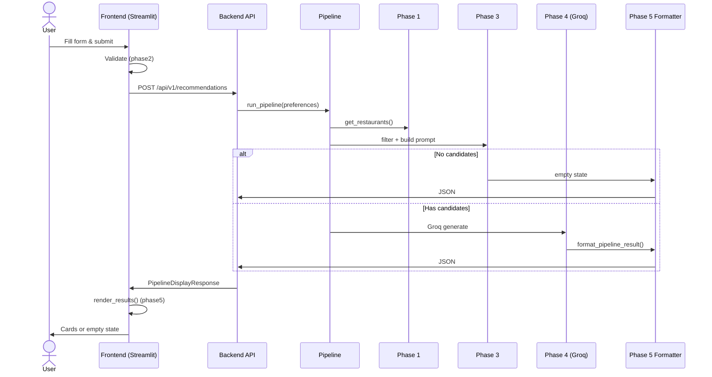
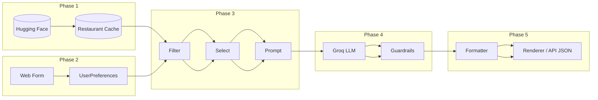
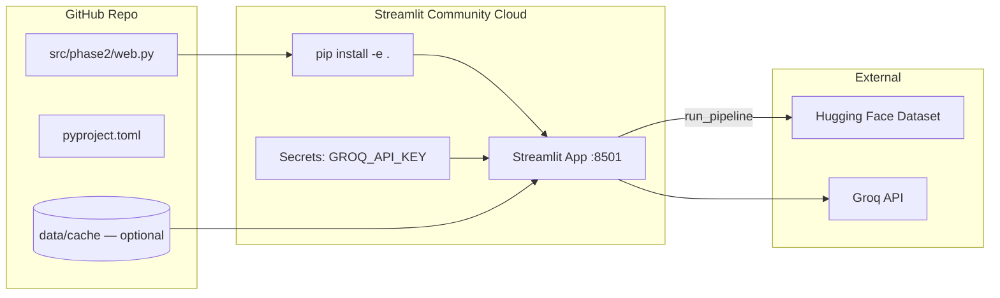
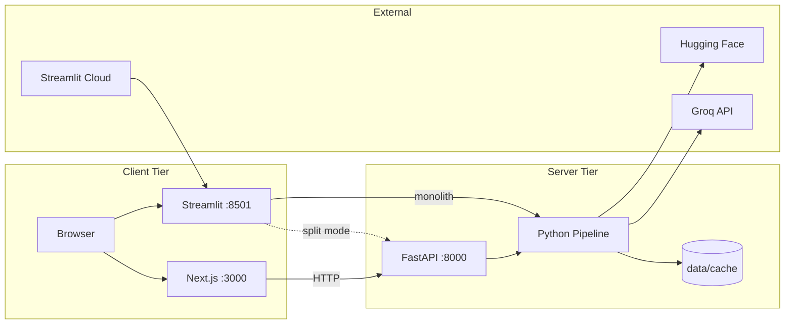

# Phase-Wise Architecture: AI-Powered Restaurant Recommendation System

This document describes the system architecture in phases, aligned with [problemstatement.md](../requirements/problemstatement.md). Phases **0–5** build the core pipeline; **Phase 6 (Backend)** and **Phase 7 (Frontend)** expose it as a proper API + web application; **Phase 8 (Deployment)** publishes the Streamlit UI to a hosted environment.

### Contents

| Phase | Section | Layer |
|---|---|---|
| — | [System Architecture (Backend + Frontend)](#system-architecture-backend--frontend) | Overview |
| 0 | [Foundation](#phase-0--foundation) | Shared |
| 1 | [Data Ingestion](#phase-1--data-ingestion) | Backend |
| 2 | [User Input](#phase-2--user-input) | Frontend (form) |
| 3 | [Integration Layer](#phase-3--integration-layer) | Backend |
| 4 | [Recommendation Engine](#phase-4--recommendation-engine) | Backend |
| 5 | [Output Display](#phase-5--output-display) | Backend + Frontend |
| **6** | [**Backend API**](#phase-6--backend-api) | **Backend** |
| **7** | [**Frontend Application**](#phase-7--frontend-application) | **Frontend** |
| **8** | [**Deployment (Streamlit)**](#phase-8--deployment-streamlit) | **Ops** |
| — | [Frontend UI Prompt (Google Stitch)](../design/frontend-ui-prompt.md) | Next.js mockups |
| — | [Deployment View](#deployment-view) | Ops |

---

## System Architecture (Backend + Frontend)



### Layer Responsibilities

| Layer | Role | Implemented In |
|---|---|---|
| **Frontend** | Collect preferences, call backend, render results | `src/phase2/web.py`, `src/phase5/renderer.py` |
| **Backend API** | HTTP boundary, request validation, JSON responses | `src/backend/api/` |
| **Backend Core** | Data load, filter, LLM, guardrails | `src/phase1/` … `src/phase4/`, `src/app/pipeline.py` |
| **Backend Formatter** | Normalize success/empty/fallback payloads | `src/phase5/formatter.py`, `src/phase5/empty_state.py` |
| **Shared Models** | Schemas used by both layers | `src/phase0/models/` |

### Project Layout (Post Phase 5)

```
MILESTONE/
├── src/
│   ├── phase0/                 # Shared — models, config, fixtures
│   ├── phase1/                 # Backend — data ingestion
│   ├── phase2/                 # Frontend input + validation
│   │   ├── builder.py          #   preference builder (also used by API)
│   │   ├── validator.py
│   │   ├── options.py          #   form dropdown data
│   │   └── web.py              #   Streamlit frontend entry
│   ├── phase3/                 # Backend — filter, prompt, integration
│   ├── phase4/                 # Backend — Groq recommendation engine
│   ├── phase5/                 # Cross-cutting display
│   │   ├── formatter.py        #   Backend — API response shape
│   │   ├── empty_state.py      #   Backend — no-match payload
│   │   ├── renderer.py         #   Frontend — Streamlit cards
│   │   └── cli.py              #   Dev/ops — CLI output
│   ├── app/
│   │   └── pipeline.py         # Backend — orchestrates phases 1–5
│   ├── backend/                # Backend REST API (Phase 6)
│   │   └── api/
│   │       ├── main.py         #   FastAPI app
│   │       └── routes.py       #   /recommendations, /options, /health
│   └── phase6/                 # Phase 6 entry (uvicorn)
├── frontend/                   # Phase 7 — Next.js App Router UI
│   └── src/
│       ├── app/                #   pages & layout
│       ├── components/         #   form, cards, empty/error states
│       └── lib/                #   API client, types, validation
├── data/cache/                 # Backend — restaurant JSON cache
├── tests/                      # Backend + frontend unit/integration tests
└── docs/
```

### API Contract (Backend)

| Method | Endpoint | Purpose |
|---|---|---|
| `GET` | `/health` | Liveness check |
| `GET` | `/api/v1/options` | Locations and cuisines for form dropdowns |
| `POST` | `/api/v1/recommendations` | Run full pipeline; return formatted JSON |

**Request body** (`POST /api/v1/recommendations`):

```json
{
  "location": "Bellandur",
  "budget": "high",
  "cuisine": "Italian",
  "min_rating": 4.0,
  "extras": "family-friendly"
}
```

**Success response** (`200`):

```json
{
  "status": "success",
  "count": 5,
  "recommendations": [
    {
      "rank": 1,
      "name": "Chili's American Grill & Bar",
      "cuisine": "American, Tex-Mex, Burger, BBQ",
      "rating": 4.6,
      "estimated_cost": "₹1,800 for two",
      "area": "Bellandur",
      "explanation": "…"
    }
  ],
  "fallback_used": false,
  "relaxed_constraints": []
}
```

**No matches** (`200`):

```json
{
  "status": "no_matches",
  "message": "No restaurants found matching preferences in Goa.",
  "suggestions": ["Try a different location", "…"],
  "recommendations": []
}
```

### Frontend ↔ Backend Flow



> **Current state:** Streamlit calls `run_pipeline()` in-process by default. The FastAPI backend in `src/backend/api/` is available for decoupled deployment — both use the same pipeline and JSON schemas.

### Run Targets

| Surface | Command | Layer |
|---|---|---|
| Frontend (Next.js) | `cd frontend && npm run dev` | Next.js on `:3000` |
| Frontend (Streamlit) | `python -m phase2` | Streamlit on `:8501` (Phase 8 deploy target) |
| Backend API | `python -m backend` or `uvicorn backend.api.main:app --reload --port 8000` | FastAPI on `:8000` |
| Backend CLI (dev) | `python -m app.main` | JSON to stdout |
| Full pipeline test | `python scripts/live_phase4_example.py` | Backend only |

---

## Pipeline Architecture (Phases 0–5)



---

## Architecture Principles

| Principle | Description |
|---|---|
| **Backend / frontend separation** | Backend owns data, filtering, LLM, and JSON responses; frontend owns forms, rendering, and user feedback. |
| **API-first backend** | All recommendation logic is exposed through `run_pipeline()` and JSON schemas — UI and CLI are thin clients. |
| **Separation of concerns** | Structured filtering happens before the LLM; the model reasons over a bounded candidate set, not the full dataset. |
| **Dataset as source of truth** | Restaurant facts (name, location, cuisine, cost, rating) come from the dataset, not from LLM hallucination. |
| **LLM for judgment, not lookup** | Groq ranks, explains, and summarizes — it does not invent restaurants. |
| **Progressive build** | Phases 0–5 built incrementally; backend and frontend integrate via shared models and response contracts. |

---

## Phase Overview

| Phase | Name | Layer | Primary Goal | Depends On |
|---|---|---|---|---|
| 0 | Foundation | Shared | Schemas, config, fixtures | — |
| 1 | Data Ingestion | Backend | Clean restaurant data from Hugging Face | Phase 0 |
| 2 | User Input | Frontend (form) | Web form + preference validation | Phase 0 |
| 3 | Integration Layer | Backend | Filter, prompt, fallback | Phases 1, 2 |
| 4 | Recommendation Engine | Backend | Rank and explain via Groq | Phase 3 |
| 5 | Output Display | Backend + Frontend | API JSON (backend) + Streamlit cards (frontend) | Phase 4 |
| **6** | **Backend API** | **Backend** | REST API over the pipeline (FastAPI) | Phases 0–5 |
| **7** | **Frontend Application** | **Frontend** | Next.js UI wired to Phase 6 API | Phases 2, 5, 6 |
| **8** | **Deployment (Streamlit)** | **Ops** | Host Streamlit app on Streamlit Cloud or self-hosted server | Phases 2, 5, 6 (optional) |

---

## Phase 0 — Foundation

**Goal:** Establish project structure, shared types, and configuration so later phases integrate cleanly.

### Components

See [Project Layout (Post Phase 5)](#project-layout-post-phase-5) for the full backend/frontend folder map.

### Key Artifacts

| Artifact | Purpose |
|---|---|
| `Restaurant` schema | Normalized restaurant record |
| `UserPreferences` schema | Typed user input (location, budget, cuisine, min rating, extras) |
| `Recommendation` schema | Final output shape (restaurant + AI explanation) |
| Environment config | Dataset ID, `GROQ_API_KEY`, model, top-N, candidate limit |
| **Layer split** | Backend (pipeline + API) vs frontend (Streamlit UI) |

### Exit Criteria

- Shared schemas defined and importable
- Config loads from environment or `.env`
- Pipeline skeleton runs end-to-end with mock data
- Backend/frontend boundaries documented

---

## Phase 1 — Data Ingestion

**Goal:** Load the Zomato dataset from Hugging Face and produce a clean, queryable restaurant collection.

**Layer:** Backend  
**Implementation:** `src/phase1/` (loader, extractor, preprocessor, store, pipeline).

### Components

| Component | Responsibility |
|---|---|
| **Dataset Loader** | Fetch dataset via `datasets` library from Hugging Face |
| **Field Extractor** | Map raw columns to `Restaurant` schema |
| **Preprocessor** | Handle nulls, normalize location/cuisine strings, parse cost ranges |
| **Data Store** | In-memory list, pandas DataFrame, or lightweight local cache (JSON/Parquet) |

### Data Flow

```
Hugging Face Dataset
        │
        ▼
  Raw records (name, location, cuisines, cost, rating, …)
        │
        ▼
  Cleaned Restaurant[] 
        │
        ▼
  Structured Store (ready for filtering)
```

### Normalization Rules (examples)

- **Location:** Standardize city names (`"bangalore"` → `"Bangalore"`)
- **Cuisine:** Split multi-cuisine strings into a list
- **Cost:** Map to numeric range or budget tier (low / medium / high)
- **Rating:** Coerce to float; drop or flag invalid rows

### Interface Contract

```python
# Output of Phase 1
get_restaurants() -> list[Restaurant]
```

### Exit Criteria

- Dataset loads successfully from Hugging Face
- All required fields populated or explicitly defaulted
- Unit tests pass on sample records

---

## Phase 2 — User Input

**Goal:** Collect user preferences through the **frontend web UI** and return a validated `UserPreferences` object.

**Layer:** Frontend (UI) + shared validation used by backend API  
**Implementation:** `src/phase2/` (validator, builder, options, `web.py` Streamlit app).

### Components

| Component | Layer | Responsibility |
|---|---|---|
| **Web UI** (`web.py`) | Frontend | Streamlit preference form and submit handler |
| **Validator** | Shared | Enforce required fields, valid enums, sensible defaults |
| **Preference Builder** | Shared | Construct typed `UserPreferences` from form or API body |
| **Options** | Backend helper | Load location/cuisine lists from dataset for dropdowns |

### Input Schema

| Field | Type | Required | Notes |
|---|---|---|---|
| `location` | string | Yes | City or area |
| `budget` | enum | Yes | `low` \| `medium` \| `high` |
| `cuisine` | string or list | No | Empty = any cuisine |
| `min_rating` | float | No | Default e.g. `0.0` |
| `extras` | string | No | Free-text (family-friendly, quick service, etc.) |

### Data Flow

```
Web UI form submission
        │
        ▼
  Raw input dict
        │
        ▼
  Validation & normalization
        │
        ▼
  UserPreferences object
```

### Interface Contract

```python
# Output of Phase 2
collect_preferences() -> UserPreferences
```

### Exit Criteria

- Web form captures all preference fields and validates on submit
- Clear inline error messages for invalid input
- Form submission produces a `UserPreferences` object passed to the pipeline
- Mock/programmatic input still supported for automated tests

---

## Phase 3 — Integration Layer

**Goal:** Bridge structured data and the LLM by filtering restaurants and building a well-structured prompt.

**Layer:** Backend  
**Implementation:** `src/phase3/` (filter, selector, prompt, fallback, integration).

### Components

| Component | Responsibility |
|---|---|
| **Filter Engine** | Apply hard constraints (location, budget, cuisine, min rating) |
| **Candidate Selector** | Cap results (e.g. top 20–50) to keep prompts within token limits |
| **Prompt Builder** | Assemble system + user prompt with preferences and candidate JSON |
| **Fallback Handler** | Return helpful message when zero candidates match |

### Filter Logic

```
All restaurants
      │
      ├─ location match
      ├─ budget tier match
      ├─ cuisine match (if specified)
      └─ rating >= min_rating
      │
      ▼
Candidate set (bounded size)
```

### Prompt Structure

| Section | Content |
|---|---|
| **System** | Role, rules (only recommend from provided list, cite facts accurately) |
| **User preferences** | Serialized `UserPreferences` |
| **Candidates** | JSON array of filtered restaurants |
| **Task** | Rank top N, explain each pick, optionally summarize trade-offs |

### Interface Contract

```python
# Phase 3 outputs
filter_restaurants(
    restaurants: list[Restaurant],
    prefs: UserPreferences,
) -> list[Restaurant]

build_prompt(
    prefs: UserPreferences,
    candidates: list[Restaurant],
) -> str
```

### Exit Criteria

- Filters return correct subsets on test cases
- Prompt fits within model context window
- Zero-match case handled without calling LLM unnecessarily

---

## Phase 4 — Recommendation Engine

**Goal:** Send the prompt to an LLM, parse the response, and produce structured ranked recommendations.

**Layer:** Backend  
**Implementation:** `src/phase4/` (Groq client, executor, parser, guardrails, fallback, engine). LLM provider: **Groq**.

### Components

| Component | Responsibility |
|---|---|
| **LLM Client** | Groq chat completions API (`groq` SDK) |
| **Prompt Executor** | Send prompt, handle retries and rate limits |
| **Response Parser** | Extract ranked list + explanations into `Recommendation[]` |
| **Guardrails** | Verify recommended names exist in candidate set |

### Data Flow

```
Prompt (from Phase 3)
        │
        ▼
  LLM API call
        │
        ▼
  Raw text / JSON response
        │
        ▼
  Parsed Recommendation[] (ranked, with explanations)
```

### LLM Responsibilities

| Task | Owner |
|---|---|
| Rank candidates by fit | LLM |
| Write human-readable explanations | LLM |
| Summarize trade-offs | LLM (optional) |
| Invent new restaurants | **Not allowed** |

### Interface Contract

```python
# Phase 4 output
generate_recommendations(prompt: str) -> list[Recommendation]
```

### Exit Criteria

- LLM returns parseable, structured output
- Recommendations only reference restaurants from the candidate set
- Explanations reference actual user preferences

---

## Phase 5 — Output Display

**Goal:** Format backend responses and render them in the frontend.

**Layer:** Backend (formatter) + Frontend (renderer)  
**Implementation:** `src/phase5/` (formatter, empty_state, renderer, cli).

### Components

| Component | Layer | Responsibility |
|---|---|---|
| **Formatter** (`formatter.py`) | Backend | Map `Recommendation[]` → `PipelineDisplayResponse` JSON |
| **Empty State** (`empty_state.py`) | Backend | No-match payload with suggestions |
| **Streamlit Renderer** (`renderer.py`) | Frontend | Recommendation cards, fallback/relaxed notices |
| **CLI Renderer** (`cli.py`) | Dev/ops | JSON or human-readable terminal output |

### Output Per Recommendation

| Field | Source |
|---|---|
| Restaurant name | Dataset |
| Cuisine | Dataset |
| Rating | Dataset |
| Estimated cost | Dataset |
| AI explanation | LLM |

### Display Surfaces

| Surface | Module | Use |
|---|---|---|
| Streamlit web UI | `phase2/web.py` + `phase5/renderer.py` | Primary user-facing app |
| REST API JSON | `phase5/formatter.py` | Backend response to any HTTP client |
| CLI | `phase5/cli.py`, `app/main.py` | Development and scripting |

### Interface Contract

```python
# Backend — API response
format_pipeline_result(...) -> dict

# Frontend — Streamlit
render_results(result: dict) -> None

# Dev CLI
render_response(result: dict) -> None
```

### Exit Criteria

- All five output fields visible per recommendation
- Readable layout with clear ranking order
- Graceful handling of partial failures (e.g. show data, hide broken explanation)

---

## Phase 6 — Backend API

**Goal:** Expose the full recommendation pipeline over HTTP so any client (Streamlit, mobile, scripts) can call it without importing Python modules directly.

**Layer:** Backend  
**Implementation:** `src/backend/api/` (`main.py`, `routes.py`, `schemas.py`, `service.py`, `errors.py`), entry via `src/phase6/`, orchestration via `src/app/pipeline.py`.

### Components

| Component | File | Responsibility |
|---|---|---|
| **FastAPI App** | `backend/api/main.py` | App factory, CORS, route registration |
| **Health** | `routes.py` | `GET /health`, `GET /api/v1/health` — liveness |
| **Options** | `routes.py` | `GET /api/v1/options` — locations & cuisines for forms |
| **Recommendations** | `routes.py` | `POST /api/v1/recommendations` — run pipeline |
| **Preference Builder** | `phase2/builder.py` | Shared validation (same rules as web form) |
| **Pipeline** | `app/pipeline.py` | Phases 1 → 3 → 4 → 5 formatter |
| **Response Formatter** | `phase5/formatter.py` | Normalized JSON (`success`, `no_matches`, `fallback_used`) |

### Data Flow

```
HTTP POST /api/v1/recommendations
        │
        ▼
  Pydantic request body (location, budget, cuisine, …)
        │
        ▼
  build_preferences() — phase2 validation
        │
        ▼
  run_pipeline(settings, preferences)
        │
        ├─ phase1: get_restaurants()
        ├─ phase3: filter + prompt
        ├─ phase4: Groq (or fallback)
        └─ phase5: format_pipeline_result()
        │
        ▼
  JSON response → client
```

### Interface Contract

```python
# Entry point
uvicorn backend.api.main:app --reload --port 8000

# Core handler (simplified)
@router.post("/api/v1/recommendations")
def recommendations(body: RecommendationRequest) -> dict:
    preferences = build_preferences(body.model_dump())
    return run_pipeline(get_settings(), preferences=preferences)
```

### Error Handling

| Condition | HTTP | Response |
|---|---|---|
| Invalid body (missing location, bad budget) | `422` | Validation detail from `PreferenceValidationError` |
| Pipeline failure | `500` | Safe message; full trace logged server-side |
| No matches | `200` | `status: "no_matches"` with suggestions |

### Exit Criteria

- `GET /health` and `GET /api/v1/options` return `200`
- `POST /api/v1/recommendations` returns the same JSON shape as `python -m app.main`
- CORS enabled for local Streamlit (`:8501`) when using split deployment
- API runs independently: `uvicorn backend.api.main:app --port 8000`

---

## Phase 7 — Frontend Application

**Goal:** Deliver the user-facing web app — preference form, loading states, recommendation cards, and empty/fallback messaging.

**Layer:** Frontend  
**Target framework:** Next.js (App Router, TypeScript, Tailwind) — see [frontend-ui-prompt.md](../design/frontend-ui-prompt.md) for Google Stitch UI generation prompt.  
**Implementation:** `frontend/` (Next.js app), entry via `cd frontend && npm run dev`.  
**Legacy prototype:** `src/phase2/web.py` (Streamlit), `src/phase5/renderer.py`.

### Components

| Component | File | Responsibility |
|---|---|---|
| **Next.js App** | `frontend/src/app/page.tsx` | Main page shell |
| **Home / state** | `frontend/src/components/HomePage.tsx` | Form submit, loading, results orchestration |
| **Preference Form** | `frontend/src/components/PreferenceForm.tsx` | Location, budget, cuisine, rating, extras |
| **API Client** | `frontend/src/lib/api.ts` | `GET /options`, `POST /recommendations` |
| **Validation** | `frontend/src/lib/validation.ts` | Client-side preference checks |
| **Result Cards** | `frontend/src/components/RecommendationCard.tsx` | Ranked recommendations with AI explanation |
| **Empty / Error UI** | `EmptyState.tsx`, `ErrorAlert.tsx`, `Notices.tsx` | No-match, API errors, fallback banners |

### Deployment Modes

| Mode | How it works | When to use |
|---|---|---|
| **Monolith (default)** | `web.py` calls `run_pipeline()` in-process | Local dev, single-server deploy |
| **Split (default for Phase 7)** | Next.js calls `POST http://localhost:8000/api/v1/recommendations` | Production frontend + API |
| **Streamlit (legacy)** | `web.py` calls `run_pipeline()` in-process | Quick Python-only dev |

### Data Flow

```
User opens Next.js (:3000)
        │
        ▼
  GET /api/v1/options → populate dropdowns
        │
        ▼
  User submits preferences
        │
        ▼
  POST /api/v1/recommendations → Phase 6 API
        │
        ▼
  Render cards, empty state, or error in React components
```

### Interface Contract

```bash
# Run frontend (Next.js)
cd frontend && npm run dev

# API base URL (frontend/.env.local)
NEXT_PUBLIC_API_URL=http://localhost:8000
```

### Exit Criteria

- Form captures location, budget, cuisine, min rating, extras
- Submit shows loading state, then cards or empty state
- Fallback and relaxed-filter notices visible when `fallback_used` or `relaxed_constraints` present
- Next.js frontend calls Phase 6 API via `NEXT_PUBLIC_API_URL`

---

## Phase 8 — Deployment (Streamlit)

**Goal:** Deploy the Python Streamlit UI to a hosted environment so users can access recommendations without running the app locally.

**Layer:** Ops / hosting  
**Implementation:** `src/phase2/web.py` (UI), `src/phase5/renderer.py` (results), `src/phase2/__main__.py` (launcher), `src/app/pipeline.py` (in-process pipeline).  
**Primary target:** [Streamlit Community Cloud](https://streamlit.io/cloud) — free hosting for public GitHub repos.

### Why Streamlit for Deployment

| Consideration | Streamlit (Phase 8) | Next.js (Phase 7) |
|---|---|---|
| **Hosting** | Native Streamlit Cloud support | Requires Node hosting (Vercel, etc.) + separate API |
| **Stack** | Single Python process | Python API + JavaScript frontend |
| **Pipeline** | Calls `run_pipeline()` in-process | Calls Phase 6 REST API over HTTP |
| **Best for** | Quick demos, Python-only deploy, class projects | Production UI, custom branding (e.g. moodmeal) |

Phase 8 is the **recommended deployment path** when you want a shareable link with minimal infrastructure. Phase 7 (Next.js) remains the primary branded frontend for local development and custom UI work.

### Components

| Component | File / artifact | Responsibility |
|---|---|---|
| **Streamlit App** | `src/phase2/web.py` | Preference form, submit handler, spinner |
| **Launcher** | `src/phase2/__main__.py` | `python -m phase2` → `streamlit run web.py` |
| **Renderer** | `src/phase5/renderer.py` | Cards, empty state, fallback/relaxed notices |
| **Pipeline** | `src/app/pipeline.py` | Full backend flow in-process (no HTTP hop) |
| **Secrets** | Streamlit Cloud Secrets / `.env` | `GROQ_API_KEY`, dataset settings |
| **Cache** | `data/cache/restaurants.json` | Optional pre-warmed dataset cache |

### Deployment Modes

| Mode | Architecture | When to use |
|---|---|---|
| **Monolith (recommended)** | Streamlit → `run_pipeline()` in-process | Streamlit Cloud, single VM, simplest ops |
| **Split** | Streamlit → `POST /api/v1/recommendations` on Phase 6 API | API and UI on separate hosts; set `BACKEND_URL` |

For Streamlit Cloud, **monolith mode** is preferred: one Python service, no CORS or second deployment.

### Streamlit Cloud Setup



**Repository settings (Streamlit Cloud):**

| Setting | Value |
|---|---|
| **Main file path** | `streamlit_app.py` (repo root) |
| **Python version** | 3.9+ |
| **Install command** | `pip install -r requirements.txt` (includes `-e .`) |

**Secrets (TOML in Streamlit Cloud dashboard):**

```toml
GROQ_API_KEY = "gsk_..."
# Optional overrides
# LLM_MODEL = "llama-3.3-70b-versatile"
# USE_DATASET_CACHE = "true"
```

### Pre-Deploy Checklist

| Step | Action |
|---|---|
| 1 | Ensure `GROQ_API_KEY` is set in Streamlit Secrets (never commit to git) |
| 2 | Run `python -m phase1` locally once; commit `data/cache/restaurants.json` **or** allow first-run download on Cloud (slower cold start) |
| 3 | Verify locally: `python -m phase2` → open `http://localhost:8501` |
| 4 | Push to GitHub; connect repo in Streamlit Cloud |
| 5 | Set main file to `streamlit_app.py` (repo root); deploy |
| 6 | Smoke-test: submit preferences; confirm cards or empty state render |

### Data Flow (Monolith Deploy)

```
User opens Streamlit Cloud URL
        │
        ▼
  web.py loads options (phase2/options.py)
        │
        ▼
  User submits form → build_preferences()
        │
        ▼
  run_pipeline() in-process (phases 1 → 3 → 4 → 5)
        │
        ▼
  render_results() (phase5/renderer.py)
        │
        ▼
  User sees recommendation cards or empty state
```

### Self-Hosted Alternative

For a VPS or internal server (without Streamlit Cloud):

```bash
pip install -e .
export GROQ_API_KEY=gsk_...
python -m phase1          # warm cache (first time)
python -m phase2          # Streamlit on :8501
```

Optional: run behind a reverse proxy (nginx) with TLS; map `/` to port `8501`.

### Interface Contract

```bash
# Local / Cloud entry
python -m phase2

# Equivalent direct invocation
streamlit run src/phase2/web.py --server.headless true
```

### Operational Notes

| Topic | Guidance |
|---|---|
| **Cold start** | First request may load Hugging Face dataset; pre-cache reduces latency |
| **Memory** | Full dataset in memory; use `use_dataset_cache=true` in settings |
| **Rate limits** | Groq 429s trigger Phase 4 fallback (rating-based top-N) |
| **Secrets rotation** | Update Streamlit Secrets; redeploy or restart app |
| **Logs** | Streamlit Cloud → app logs; check pipeline exceptions server-side |

### Exit Criteria

- App deploys successfully on Streamlit Community Cloud (or self-hosted equivalent)
- Public URL loads the preference form without errors
- Submit returns recommendations, empty state, or clear validation errors
- `GROQ_API_KEY` loaded from secrets; not present in repository
- Dataset cache strategy documented (committed cache vs on-demand load)

---

## Deployment View



| Deployment mode | Phase | Description |
|---|---|---|
| **Streamlit Cloud (Phase 8)** | 8 | Host `web.py` on Streamlit Community Cloud; monolith pipeline |
| **Next.js + API (Phase 7 + 6)** | 7, 6 | moodmeal UI on `:3000`, FastAPI on `:8000` |
| **Streamlit monolith (local)** | 2, 8 | `python -m phase2` — single Python process |
| **Streamlit split** | 8 | Streamlit UI + FastAPI backend as separate services |
| **CLI only** | 5 | `python -m app.main` for backend testing without UI |

---

## Suggested Build Order

```mermaid
gantt
    title Implementation Timeline
    dateFormat  X
    axisFormat %s

    section Foundation
    Phase 0 — Schemas & config     :p0, 0, 1

    section Parallel tracks
    Phase 1 — Data ingestion       :p1, 1, 3
    Phase 2 — User input           :p2, 1, 2

    section Integration
    Phase 3 — Filter & prompts     :p3, 3, 5

    section Intelligence
    Phase 4 — LLM engine           :p4, 5, 7

    section Delivery
    Phase 5 — Output display       :p5, 7, 8
    Phase 6 — Backend API          :p6, 8, 9
    Phase 7 — Frontend app         :p7, 8, 10
    Phase 8 — Streamlit deploy       :p8, 10, 11
```



Phases 1 and 2 can be built in parallel after Phase 0. Phase 3 requires both. Phases 4 and 5 are sequential. **Phase 6** wraps the pipeline in FastAPI after Phase 5. **Phase 7** is the Next.js frontend (calls Phase 6 over HTTP). **Phase 8** deploys the Streamlit UI to Streamlit Cloud or a self-hosted server (monolith or split with Phase 6).

---

## Technology Stack

| Layer | Technology | Purpose |
|---|---|---|
| **Backend language** | Python 3.9+ | Pipeline, API, data processing |
| **Backend API** | FastAPI + Uvicorn (`phase6` / `src/backend/api/`) | REST endpoints for recommendations |
| **Backend orchestration** | `app/pipeline.py` | Wires phases 1–5 |
| **Data** | Hugging Face `datasets`, local JSON cache | Zomato restaurant dataset |
| **LLM** | Groq (`llama-3.3-70b-versatile`) | Ranking and explanations |
| **Schemas** | Pydantic (`phase0/models`) | Shared request/response models |
| **Frontend** | Next.js (`frontend/`) + Streamlit (`phase2/web.py`) | Form input + result cards |
| **Deployment** | Streamlit Community Cloud (Phase 8) | Hosted Python UI + in-process pipeline |
| **Config** | `python-dotenv`, `pydantic-settings` | `.env` for keys and limits |
| **Tests** | pytest | Per-phase + integration tests |

---

## Error Handling by Phase

| Phase | Failure | Response |
|---|---|---|
| 1 | Dataset load fails | Retry; surface clear error with dataset URL |
| 2 | Invalid user input | Inline validation message; do not proceed |
| 3 | Zero filter matches | Skip LLM; suggest broader preferences |
| 4 | LLM timeout / bad parse | Retry once; fallback to rule-based top-N by rating |
| 5 | Render error | Return raw JSON as fallback; frontend shows generic error |
| 6 (API) | Invalid request body | `422` with validation detail |
| 6 (API) | Pipeline exception | `500` with safe message; log server-side |
| 7 (UI) | Backend unreachable (split mode) | User-friendly error; retry prompt |
| 7 (UI) | Malformed API response | Generic error; log response body |
| 8 (Deploy) | Missing `GROQ_API_KEY` in secrets | App loads; recommendations use rating fallback |
| 8 (Deploy) | Dataset download fails on cold start | Show error in Streamlit; suggest pre-warmed cache |
| 8 (Deploy) | Streamlit Cloud build fails | Check `pyproject.toml` deps and main file path |
| 8 (Deploy) | App timeout on first request | Pre-run `phase1` and commit cache; increase Cloud resources if needed |

---

## Related Documents

- [Problem Statement](../requirements/problemstatement.md) — requirements and success criteria
- [Frontend UI Prompt (Google Stitch)](../design/frontend-ui-prompt.md) — copy-paste prompt for Next.js UI mockups
